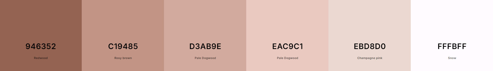

# **React Assignment: Interactive Grid Layout**

## **Description**
This project demonstrates a beginner-friendly React application with a responsive grid layout. It includes interactive components that showcase:
- A **live clock** displaying the current time, updated every second.
- A **button click counter** that tracks the number of clicks dynamically.

The app is styled with a **soft pastel color palette** for an elegant and clean appearance, making it visually appealing and user-friendly.

---

## **Features**
- **Live Clock**: Displays the current time and updates every second.
- **Click Counter**: Tracks and displays the number of times a button has been clicked.
- **Responsive Grid Layout**:
  - **Header** and **Footer** styled with a warm pink-brown tone.
  - Two interactive sections organized in a two-column grid (left and right).
- **Dynamic Styling**:
  - Pastel color palette for a harmonious look.
  - Smooth button hover and active effects.

---

## **Color Palette**
The app uses a warm and soft pastel color palette:
- **Header and Footer**: `#D3AB9E` (Soft Pink-Brown).
- **Left Column**: `#FFFBFF` (Off-White) with text in `#EAC9C1` (Pale Pink).
- **Right Column**: `#EBD8D0` (Light Beige) with text in `#D3AB9E`.
- **Button**:
  - Default: `#D3AB9E`.
  - Hover: `#C19485` (Muted Brown).
  - Active: `#946352` (Dark Brown).



---

## **Technologies Used**
- **React**: For building interactive components.
- **Babel**: For transpiling JSX into JavaScript.
- **HTML and CSS**: For structuring and styling the application.

---

## **Installation and Usage**
1. **Clone the Repository**:
   ```bash
   git clone https://github.com/coconath0/dynamic-react-layout.git
   cd dynamic-react-layout
   ```

2. **Open the App**:
   - Open the `index.html` file in any modern browser to view the app.

---

## **File Structure**
```
dynamic-react-layout/
├── index.html  # Main HTML file containing the entire app code
├── color-palette.png
```
---

## **Future Improvements**
- Make the app fully responsive for smaller screens.
- Add additional features like a date picker or a custom counter increment.
- Integrate a theme toggle for light/dark modes.